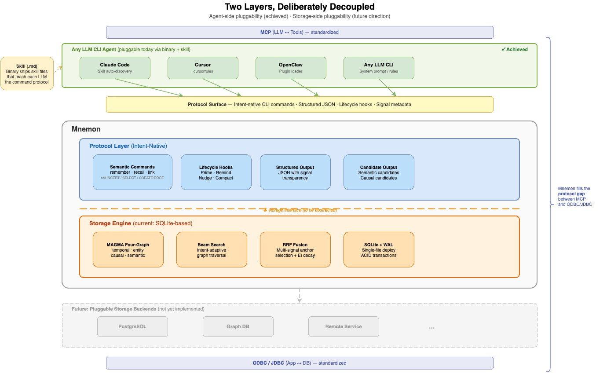

# 2. Engine Design Philosophy

[< Back to Design Overview](../DESIGN.md)

---

## 2.1 LLM-Supervised: Binary as Organ, LLM as Supervisor

Traditional LLM memory systems (such as Mem0 and the original MAGMA implementation) embed a small LLM inside the pipeline to handle memory operations — entity extraction, conflict detection, causal reasoning. This is the **LLM-Embedded** pattern.

Mnemon adopts the **LLM-Supervised** pattern:

| Pattern | Where is the LLM | What does the LLM do | Representative |
|---------|------------------|---------------------|----------------|
| **LLM-Embedded** | Inside the pipeline | Executor (extraction, classification, reasoning) | Mem0, MAGMA |
| **File Injection** | Reads file at session start | None — static file loaded into context window | Claude Code CLAUDE.md |
| **MCP Server** | Tool provider via MCP protocol | Exposes memory operations as MCP tools for the host LLM | MemCP |
| **LLM-Supervised** | Outside the pipeline | Supervisor (reviews candidates, makes judgments, decides trade-offs) | Mnemon |

Under the LLM-Supervised pattern, responsibilities are clearly separated into two tiers:

| Tier | Role | Handles |
|------|------|---------|
| **Binary (organ)** | Deterministic computation | Storage, graph indexing, keyword search, vector math, decay formulas, auto-pruning |
| **Host LLM (supervisor)** | High-value judgment | Causal chain evaluation, semantic relevance judgment, entity enrichment, memory retention decisions |

This means:

- **Zero additional API cost**: All computation happens locally
- **Stronger judgment capability**: An Opus-class LLM evaluates candidate links, not gpt-4o-mini
- **LLM swappable**: The same Binary + Skill works across Claude Code, Cursor, or any LLM CLI

This engine follows the broader [Mnemon Memory Harness](../framework/HARNESS.md) stance:
hook-native, LLM-led, and protocol-constrained. The framework doctrine is kept
separate from the current engine architecture so we can discuss principles
without assuming today's binary is the final runtime shape.

## 2.2 Tools are Organs, Skills are Textbooks

This philosophy can be understood through a game development analogy:

| Game Development | Agent Ecosystem | Mnemon Equivalent |
|-----------------|-----------------|-------------------|
| Game engine (Unity/Unreal) | LLM CLI (Claude Code/Cursor) | Host environment |
| Native plugin (C++ Plugin) | Binary tool | `mnemon` binary |
| Script/Blueprint (C#/Blueprint) | Skill (.md definition) | `SKILL.md` command reference |
| Gameplay logic | Agent behavior config | `guide.md` execution manual |

- **Binary = Organ** — defines what *can* be done. Encapsulates storage, graph traversal, lifecycle management, and other deterministic capabilities
- **Skill (.md) = Textbook** — defines *how* to do it. Teaches the LLM when to retrieve memories, how to judge deduplication, and which commands to invoke

Binary encapsulates all logic that does not require an LLM; Skill only teaches the LLM the parts that require intelligent judgment. **Memory management logic moves from prompt to code — deterministic, testable, portable.**

## 2.3 Memory Gateway: Protocol, Not Database

Most Agent memory projects blend two distinct problems into one: **how to store and retrieve memories** (a storage engine problem) and **how an LLM decides when to write, what to query, and how to interpret results** (an interaction protocol problem). Mem0 embeds LLM calls inside the write path — storage and LLM logic are interleaved. MemGPT invents OS-style memory paging where the context management strategy is inseparable from the storage model. OpenViking builds its own virtual filesystem abstraction. Each project reinvents the LLM-to-database interaction layer from scratch — the equivalent of every web application inventing its own HTTP.

**The protocol stack has a gap.** MCP standardizes how LLMs discover and invoke tools. ODBC/JDBC standardizes how applications access databases. But how LLMs interact with databases using memory semantics — this layer has no protocol:

```
  LLM
   ↕  MCP (LLM ↔ Tools)         ← standardized
  Tools
   ↕  ??? (LLM ↔ Database)      ← no protocol exists
  Database
   ↕  ODBC/JDBC (App ↔ Database) ← standardized
  Storage
```

Mnemon treats these as two separate layers by design:



Both layers carry real value. The **storage engine** — four-graph model, intent-adaptive Beam Search, RRF fusion, EI decay — is where retrieval quality comes from. The **protocol surface** — CLI commands, structured JSON output with signal transparency, lifecycle hooks — defines how any LLM interacts with memory. Neither alone would be sufficient.

**Why the protocol surface has this shape.** The three core commands — `remember`, `link`, `recall` — are not an arbitrary API design. They map to the universal paradigm of graph construction engines: **Extract → Candidate → Associate**. Every agent memory system, regardless of its underlying storage model, implements these three primitives — the differences lie only in how explicit or degenerate each step is. The write path decomposes into `remember` (Extract + Candidate) and `link` (Associate); the read path is `recall` (Extract + Candidate + Associate in reverse). On graph-structured storage, this paradigm achieves its most complete expression, and crucially, read and write paths are **symmetric**: both follow the same three-step model in opposite directions, meaning the LLM needs to master only one cognitive pattern for both operations.

This positions Mnemon's protocol surface as analogous to MCP:

| Dimension | MCP | Memory Layer Protocol |
|-----------|-----|-----------------------|
| **Problem** | How LLMs discover and invoke tools | How LLMs read/write databases with memory semantics |
| **Primitives** | 3 (resources / tools / prompts) | 3 (remember / link / recall) |
| **Backend-agnostic** | Any tool implements MCP server | Any DB implements protocol adapter |
| **Protocol nature** | Discovery + invocation | Write + associate + retrieve |

**Agent-side pluggability is already achieved.** Through binary distribution + skill files, the upper boundary is decoupled today. The same `mnemon` binary ships with a skill definition (`.md`) that teaches each host LLM the command protocol. Claude Code discovers it as a skill, Cursor reads it as rules, OpenClaw loads it as a plugin — the agent-side integration is a markdown file, not a code dependency. Swapping the LLM or the CLI framework requires zero changes to the binary.

This mirrors Claude Code's foundational design insight: **separate engineering problems from LLM problems.** Claude Code does not reinvent the terminal — it lets the LLM operate Unix's decades of accumulated tooling through bash. Mnemon follows the same principle: build a specialized storage engine for memory graphs, and expose it to LLMs through a clean protocol boundary. DB optimization belongs to DB; LLM interaction belongs to the protocol layer.

## 2.4 Key Insights

- **No need to build the engine layer yourself** — major vendors continuously optimize LLMs and CLI tools; developers just adopt and use them
- **Skills have near-zero marginal cost** — defining agent behavior via markdown is like game blueprints enabling non-programmers to participate
- **The memory layer is the only part worth deep investment** — memory has a compound interest effect; it is the dividing line between an agent as a "tool" versus an "assistant"
- **The LLM itself is the best orchestrator** — no need for Python DAG orchestration of call chains; the LLM reads the Skill and knows what to do
- **Separate storage from protocol** — how memories are stored and retrieved (engine) and how an LLM interacts with them (protocol) are different problems with different optimization strategies. Keeping them decoupled lets each side evolve independently

## 2.5 Theoretical Foundations

Mnemon's design draws on the **paradigm** of one paper and the **methodology** of another, while making its own engineering choices for the bridge between them.

**RLM Paradigm: LLM as Orchestrator**

The [Recursive Language Models](https://arxiv.org/abs/2512.24601) paper (Zhang, Kraska & Khattab, MIT 2025) establishes the paradigm that LLMs are more effective as orchestrators of external structured environments than as direct data processors. The paper's key findings at the paradigm level:

- An 8B model handles inputs **100x beyond its context window** by treating data as external environment variables
- **Two-stage pipelines** (fast filtering + LLM semantic verification) consistently outperform single-pass approaches
- Passing **constant-size metadata** — not raw data — to the model is more effective

The RLM paper's own implementation uses **code generation + Python REPL** as the interaction mechanism: the LLM writes Python code, a sandbox executes it, and results feed back. Mnemon shares the paradigm but takes a different path at the protocol level (see below).

**RLM Corollary: Why Memory Protocols Must Be Intent-Native**

The three RLM findings above are not just about LLM capability — they constrain what a memory protocol must look like. If the LLM is an orchestrator, the protocol must speak at the orchestrator's level: **intent and semantics**, not mechanism and syntax.

| RLM Finding | Protocol Implication | Anti-Pattern It Explains |
|-------------|---------------------|--------------------------|
| LLM as orchestrator, not data processor | Protocol should let the LLM express *what it needs* (intent), not *how to get it* (mechanism) | Embedding an LLM to do entity extraction demotes it from orchestrator to data processor |
| Constant-size metadata over raw data | Protocol output should be semantic summaries with signal transparency, not database rows | Systems that return raw query results force the LLM to re-derive meaning from data |
| Two-stage pipeline outperforms single-pass | Deterministic filtering and LLM judgment must be separated into distinct stages | Mixing both inside an embedded LLM call is the single-pass pattern RLM disproves |

Many existing projects embed LLM calls into the memory pipeline — for entity extraction, conflict detection, causal reasoning. This reveals a diagnostic pattern: **when a protocol cannot express semantic intent, the system compensates by injecting an LLM to bridge the gap.** The embedded LLM is doing two jobs simultaneously: **semantic compensation** (the protocol lacks expressiveness, so the LLM translates between intent and mechanism) and **intelligent judgment** (genuinely requires LLM reasoning). Mnemon separates these concerns: raise the protocol's expressiveness to handle the first, and delegate the second to the host LLM as supervisor.

RLM's own implementation choice offers indirect support. The paper chose code generation + Python REPL because no domain-specific semantic protocol existed for structured data interaction — Python is the universal fallback. But for the memory domain, code generation is over-generic: the LLM must translate its intent ("find causally related memories") into Python code (`graph.query(type='causal', ...)`), introducing a translation step that is both an information-loss point and an error surface. A domain-specific protocol eliminates this translation:

```
Code generation (RLM):    intent → Python code → execute → result → interpret
Semantic protocol (Mnemon): intent → mnemon recall "..." --intent causal → result
```

The fewer translation steps between LLM intent and system action, the more faithful the interaction. This is why the protocol surface uses `remember` instead of INSERT, `link` instead of CREATE EDGE, `recall` instead of SELECT — **command names are semantic, not syntactic**, mapping directly to the LLM's cognitive vocabulary rather than the database's operational vocabulary.

**MAGMA Methodology: Four-Graph Memory Architecture**

The [MAGMA](https://arxiv.org/abs/2601.03236) paper provides the concrete methodology for **what the external environment should contain**. Its key contribution: a single edge type (e.g., vector similarity) is insufficient for memory — different query intents require different relational perspectives. MAGMA's four-graph architecture (temporal, entity, causal, semantic) with intent-adaptive retrieval and multi-signal fusion gives Mnemon its data model and retrieval algorithms.

**Graph-LLM Structural Insight: Why This Protocol Shape**

Graph data models are structurally isomorphic to how LLMs organize information. LLM attention, graph data models, and natural language all describe the same thing — weighted associations between entities:

```
LLM Attention:     token ←weight→ token
Graph Model:       node  ←edge→   node
Natural Language:  subject ←predicate→ object
```

This is not a metaphor. The Transformers-as-GNNs literature (arXiv 2506.22084, 2012.09699) has formally proven that transformer attention is computationally equivalent to GNN operations on complete graphs. Mnemon extends this insight from the computational level to the storage level: **if the LLM internally operates on graphs, then external memory stored as graphs is a structural match, not an engineering convenience.**

Other storage types are degenerate forms of graphs — each loses a dimension of relational semantics:

| Storage Type | What's Lost |
|-------------|-------------|
| **KV** | Isolated nodes, zero edges |
| **Relational** | Edges compressed to foreign keys, types fixed at schema design time |
| **Document** | Edges inlined as nesting, global traversability lost |
| **Vector** | All edges are a single type (similarity), no semantic distinction |

A vector database can answer "what is **similar** to what" but cannot answer "what **caused** what" or "what **belongs to** what". This observation aligns with the Graph-based Agent Memory survey (Chang Yang et al., arXiv 2602.05665, Feb 2026), which independently concludes that "traditional memory forms can be viewed as degenerate or simplified cases within the graph memory paradigm."

This structural analysis yields two results that directly shape Mnemon's protocol:

1. **Universal algebra**: `remember` (Extract), `link` (Associate), `recall` (Retrieve) are the minimal complete interface for any agent memory system. Every system — from native RAG to OpenViking to Mem0 — instantiates these three primitives, with varying degeneracy of `link`. The more degenerate the `link` operation, the more burden falls on the LLM at recall time to infer associations that were never stored. Separating `link` as a first-class primitive — rather than folding it into the write or read path — is a contribution not found in prior frameworks (CoALA's retrieval/reasoning/learning, or standard CRUD APIs).
2. **Read-write symmetry**: On graph-structured storage, both the write path (text → graph) and the read path (graph → text) follow the same Extract → Candidate → Associate model. This means the LLM needs to master only one cognitive pattern for both `remember` and `recall` — a property that does not hold for relational or document databases.

For the full analysis including cross-system validation, degeneracy spectrum, protocol gap analysis, and academic positioning, see [Graph Model & Theory](04-graph-model.md).

**Mnemon's Own Contribution: The Engineering Bridge**

None of these theoretical sources address how to connect an LLM orchestrator to a graph-structured memory in production. Mnemon fills this gap:

| Layer | Source | Choice |
|---|---|---|
| **Paradigm** — who orchestrates? | RLM | The host LLM, not an embedded model |
| **Protocol semantics** — why intent-native? | RLM | LLM expresses intent, not mechanism; two-stage validates the separation |
| **Methodology** — what's in the environment? | MAGMA | Four-graph with intent-adaptive retrieval |
| **Protocol algebra** — why this shape? | Graph-LLM Insight | remember/link/recall as universal primitives; read-write symmetry |
| **Protocol** — how do they talk? | Mnemon | CLI commands + structured JSON (not code generation) |
| **Lifecycle** — how does memory evolve? | Mnemon | Hook-driven remember → diff → link → gc |
| **Distribution** — how to ship it? | Mnemon | Single Go binary, zero dependencies |

Where the RLM implementation relies on code generation in a sandboxed REPL (flexible but requires a runtime and raises safety concerns), Mnemon uses deterministic CLI commands as the symbolic interface — constrained, but auditable, portable, and zero-sandbox. Where MAGMA's reference implementation is a Python library with in-memory NetworkX graphs, Mnemon persists everything in SQLite with a complete write-back lifecycle.

The result is: **RLM's paradigm + MAGMA's methodology + a CLI-native engineering path** that runs on any LLM CLI without Python, without sandboxes, without API keys.


