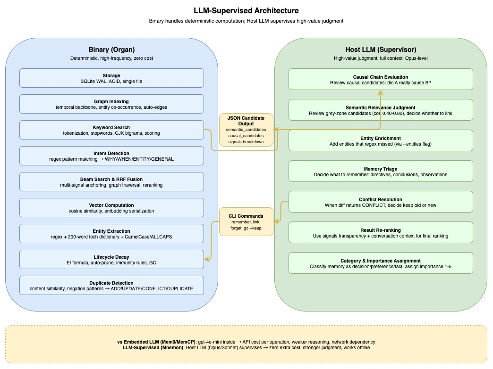
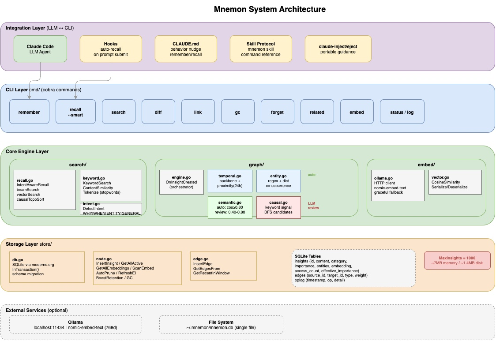
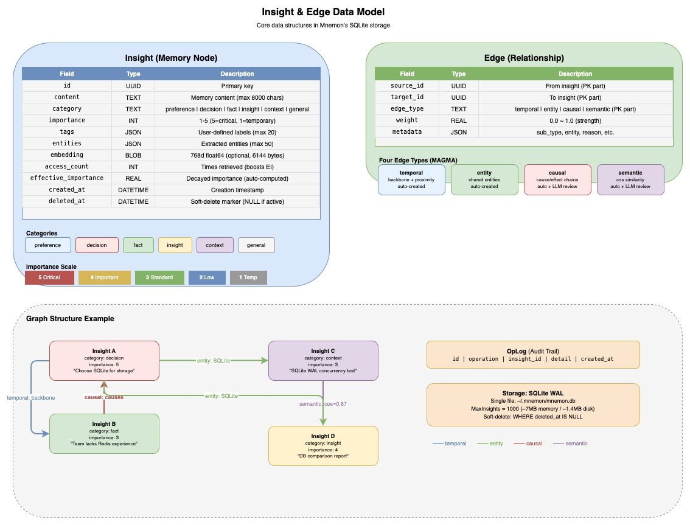
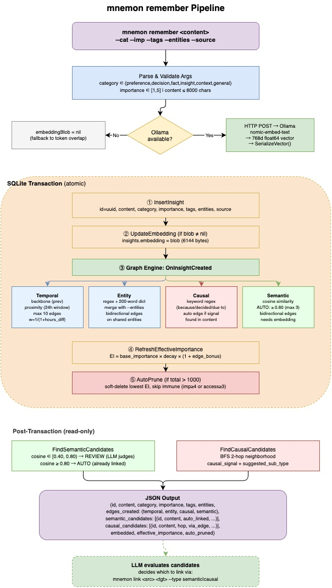
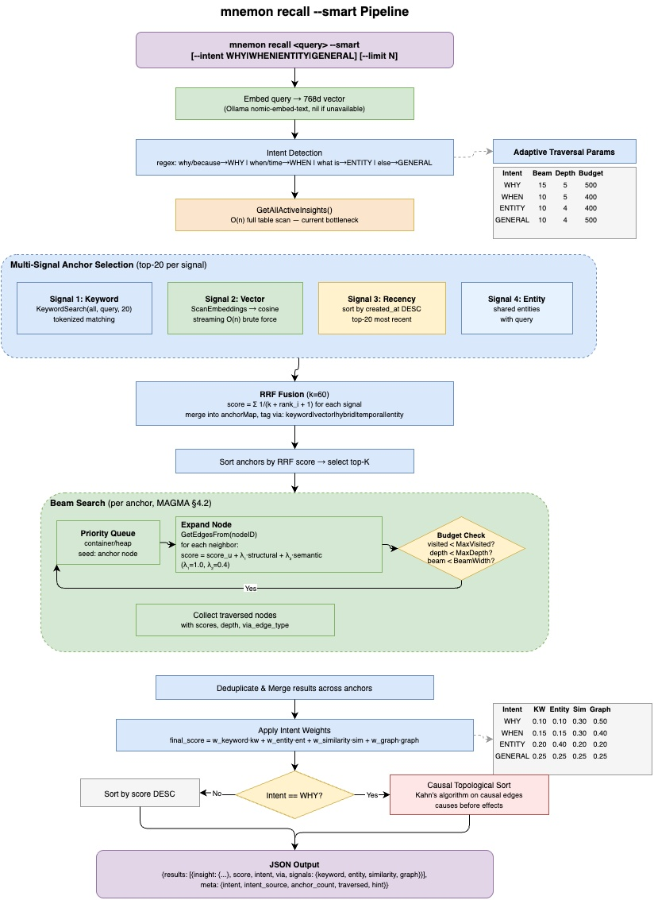
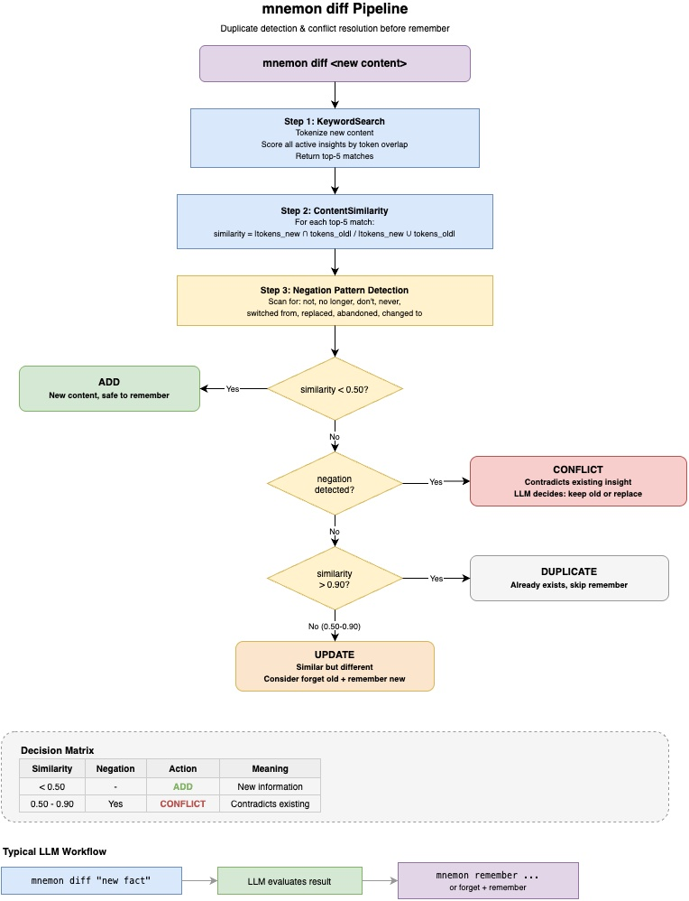
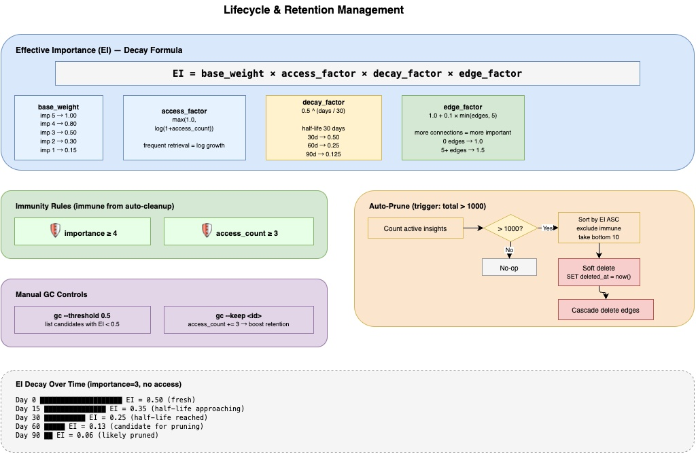
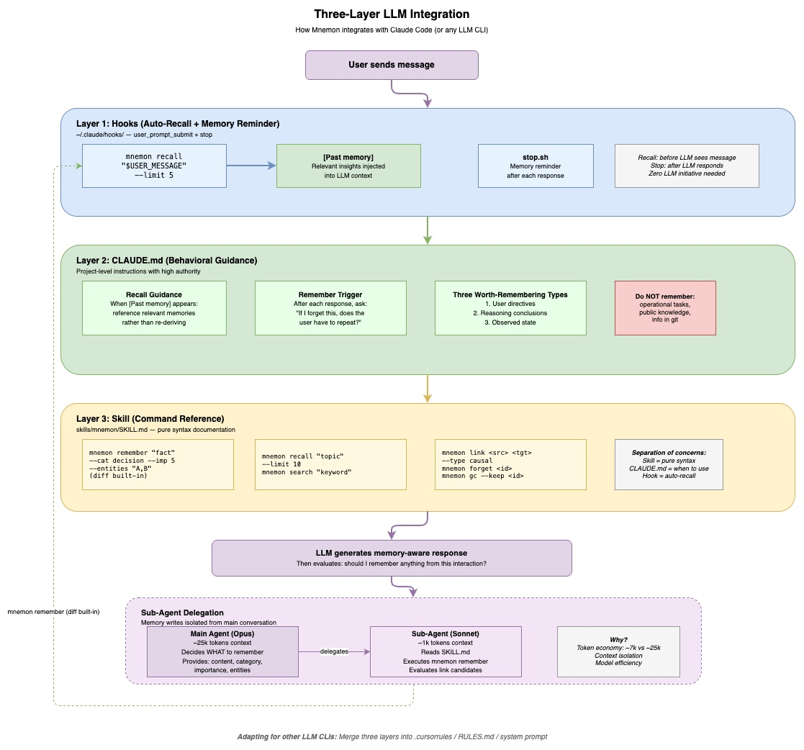

# Mnemon — Design & Architecture

> **Mnemon**（/ˈniːmɒn/），源自古希腊语 μνήμων（mnḗmōn），由 μνάομαι（"铭记"）与施事后缀 -μων 构成，意为"铭记者、善于记忆之人"。荷马在《奥德赛》中以 "καὶ γὰρ μνήμων εἰμί"（我记得很清楚）描述这一特质。在古希腊城邦制度中，Mnemones 是专职的记录官员，在财产交易与法律程序中承担见证与存档职责，是口述传统向书面记录过渡时期的制度性记忆载体。
>
> 该词同源于记忆女神 Mnemosyne（Μνημοσύνη）——宙斯与她结合诞生了九位缪斯，象征记忆是一切知识与创造的源泉。

Mnemon 是一个为 LLM 智能体设计的持久化记忆系统。它基于 [MAGMA](https://arxiv.org/abs/2601.03236)（Multi-Graph Agentic Memory Architecture）论文的四图架构，以单一 Go 二进制 + SQLite 的形式实现，不依赖任何外部 API。

本文档详细描述 Mnemon 的设计理念、核心概念、系统架构和关键算法。

---

## 目录

- [1. 愿景与问题](#1-愿景与问题)
- [2. 设计哲学](#2-设计哲学)
- [3. 核心概念](#3-核心概念)
- [4. 系统架构](#4-系统架构)
  - [4.1 数据目录布局](#41-数据目录布局)
  - [4.2 记忆体隔离](#42-记忆体隔离)
- [5. MAGMA 四图模型](#5-magma-四图模型)
- [6. 写入管线：Remember](#6-写入管线remember)
- [7. 读取管线：Smart Recall](#7-读取管线smart-recall)
- [8. 去重与冲突检测：Diff](#8-去重与冲突检测diff)
- [9. 生命周期管理](#9-生命周期管理)
- [10. 嵌入向量支持](#10-嵌入向量支持)
- [11. LLM CLI 集成](#11-llm-cli-集成)
- [12. 设计决策与权衡](#12-设计决策与权衡)

---

## 1. 愿景与问题

### 1.1 记忆是 Agent 的灵魂

没有可靠的长期记忆，LLM 智能体永远只能是"工具"，无法进化为"助手"。

记忆层具有**复利效应**——使用越久，积累越多，价值越高。这是 agent 生态中唯一需要深耕且不可替代的部分：LLM 引擎会持续迭代（Anthropic/OpenAI/Google 等），Skill 的边际成本极低（写 markdown 即可），但记忆是跟随用户持续积累的私有资产。

### 1.2 LLM 的"失忆"问题

LLM 智能体存在三个致命的记忆缺陷：

- **上下文压缩丢失**：`/compact` 或自动压缩之后，之前的决策、发现、上下文全部丢失
- **跨会话遗忘**：每次新会话都从零开始，对旧会话一无所知
- **长会话衰减**：上下文窗口塞满后，早期关键信息被挤出注意力范围

对于需要"持续学习用户思维、成为用户延伸"的数字助手来说，这三个缺陷意味着用户必须反复重申偏好、重新解释项目背景、重复推导已有结论。

### 1.3 传统方案的结构性瓶颈

现有的 RAG/Memory 方案存在根本性的设计局限：

1. **记忆是附属品**——生命周期绑定 agent 会话，不是独立实体
2. **写入是被动的**——对话结束后提取摘要（reactive），丢失结构信息
3. **检索是扁平的**——仅靠向量相似度，无法表达时间/因果/矛盾关系
4. **没有遗忘机制**——全记或 TTL 一刀切，无智能衰减
5. **依赖重**——需要 API Key、外部数据库、网络连接

### 1.4 Mnemon 的定位

Mnemon 的目标是：**让 LLM 像有经验的助手一样，记住你的决策、理解你的偏好、追踪项目上下文——跨越任意多的会话。**

它不是嵌入某个 agent 框架的库或插件，而是一个独立的记忆引擎——可被 Claude Code、Cursor、或任何 LLM CLI 通过命令行调用。

### 1.5 方案对比

| 维度 | Mem0 | Letta/MemGPT | MemCP | **Mnemon** |
|------|------|-------------|-------|-----------|
| **架构** | SDK 嵌入调用链 | Agent 框架内 | MCP Plugin | 独立 Binary |
| **LLM 角色** | 内部提取函数 | Agent 自主管理 | Sub-agent 编排 | 外部监督者 |
| **图谱** | Neo4j 单一关系边 | 无 | MAGMA 四图 | MAGMA 四图 |
| **外部依赖** | PostgreSQL + LLM API | PostgreSQL + LLM API | 零 | 零 |
| **LLM 可替换** | 绑定 OpenAI | 绑定框架 | 绑定 Claude Code | 任意 LLM CLI |
| **记忆生命周期** | 规则引擎 | 无内置衰减 | 3-区 (Active/Archive/Purge) | EI 衰减 + GC + 免疫 |

---

## 2. 设计哲学

### 2.1 LLM-Supervised：Binary 是器官，LLM 是监督者

传统的 LLM 记忆系统（如 Mem0、MAGMA 原始实现）在管线内部嵌入一个小型 LLM 来处理记忆操作——实体提取、冲突检测、因果推理。这是 **LLM-Embedded** 模式。

Mnemon 采用 **LLM-Supervised** 模式：

| 模式 | LLM 在哪 | LLM 做什么 | 代表 |
|------|---------|-----------|------|
| **LLM-Embedded** | 管线内部 | 执行者（提取、分类、推理） | Mem0, MAGMA |
| **MCP Server** | 通过 MCP 协议提供工具 | 将记忆操作暴露为 MCP 工具，供宿主 LLM 调用 | MemCP |
| **LLM-Supervised** | 管线外部 | 监督者（审查候选、做判断、决策取舍） | Mnemon |

在 LLM-Supervised 模式下，职责清晰分为两层：

| 层级 | 角色 | 处理内容 |
|------|------|----------|
| **Binary（器官）** | 确定性运算 | 存储、图索引、关键词搜索、向量计算、衰减公式、自动剪枝 |
| **宿主 LLM（监督者）** | 高价值判断 | 因果链评估、语义相关性判断、实体补充、记忆取舍决策 |

这意味着：

- **零额外 API 成本**：所有计算在本地完成
- **更强的判断能力**：Opus 级别的 LLM 评估候选链接，而非 gpt-4o-mini
- **LLM 可替换**：同一套 Binary + Skill 可在 Claude Code、Cursor、任何 LLM CLI 中使用

### 2.2 Tools are Organs, Skills are Textbooks

这一哲学可以用游戏开发的类比来理解：

| 游戏开发 | Agent 生态 | Mnemon 对应 |
|---------|-----------|-------------|
| 游戏引擎（Unity/Unreal） | LLM CLI（Claude Code/Cursor） | 宿主环境 |
| 原生插件（C++ Plugin） | Binary 工具 | `mnemon` 二进制 |
| 脚本/蓝图（C#/Blueprint） | Skill（.md 定义） | `SKILL.md` 命令参考 |
| Gameplay 逻辑 | Agent 行为配置 | `guide.md` 执行手册 |

- **Binary = Organ（器官）**——能不能做。封装存储、图遍历、生命周期管理等确定性能力
- **Skill（.md）= Textbook（教材）**——怎么做。教 LLM 何时检索记忆、如何判断去重、怎样调用命令

Binary 封装了所有不需要 LLM 的逻辑，Skill 只教 LLM 做需要智能判断的部分。**记忆管理逻辑从 prompt 变成代码——确定性、可测试、可移植。**

### 2.3 核心洞察

- **引擎层不需要自己建**——大厂持续优化 LLM 和 CLI 工具，开发者只需引入即用
- **Skill 层边际成本极低**——写 markdown 即可定义 agent 行为，类似游戏蓝图让非程序员也能参与
- **记忆层是唯一需要深耕的部分**——记忆有复利效应，是 agent 从"工具"变成"助手"的分界线
- **LLM 本身就是最好的编排器**——不需要 Python DAG 编排调用链，LLM 读了 Skill 就知道该怎么做





---

## 3. 核心概念



### 3.1 Insight（记忆节点）

Insight 是 Mnemon 中的基本记忆单元。每条 insight 代表一个独立的知识片段：

```
┌─────────────────────────────────────────────┐
│ Insight                                     │
├─────────────────────────────────────────────┤
│ id         : UUID                           │
│ content    : "选择 Qdrant 而非 Milvus..."    │
│ category   : decision                       │
│ importance : 5  (1-5)                       │
│ tags       : ["vector-db", "architecture"]  │
│ entities   : ["Qdrant", "Milvus"]           │
│ source     : "user"                         │
│ access_count        : 3                     │
│ effective_importance : 0.85                  │
│ created_at : 2026-02-18T10:00:00Z           │
└─────────────────────────────────────────────┘
```

**类别（Category）** 分为六种，帮助区分记忆的性质：

| 类别 | 含义 | 示例 |
|------|------|------|
| `preference` | 用户偏好 | "偏好使用中文交流" |
| `decision` | 架构/技术决策 | "选择 SQLite 而非 PostgreSQL" |
| `fact` | 客观事实 | "API 限流为 100 req/s" |
| `insight` | 推理结论 | "Beam search 比 full BFS 更适合…" |
| `context` | 项目上下文 | "Phase 3 已完成，118 个测试通过" |
| `general` | 通用 | 不属于以上分类的内容 |

**重要度（Importance）** 从 1 到 5，影响检索排序和生命周期：

- **5**：关键决策，永远不会被自动清理
- **4**：重要事实，免疫自动剪枝
- **3**：标准记忆
- **2**：低优先级
- **1**：临时信息，最先被清理

### 3.2 Edge（关系边）

Edge 连接两个 insight，代表它们之间的关系。每条边包含：

```
┌────────────────────────────────────────────┐
│ Edge                                       │
├────────────────────────────────────────────┤
│ source_id  : UUID  ──→  target_id : UUID   │
│ edge_type  : temporal | semantic |         │
│              causal   | entity             │
│ weight     : 0.0 ~ 1.0                    │
│ metadata   : {"sub_type": "backbone", ...} │
└────────────────────────────────────────────┘
```

四种边类型构成 MAGMA 四图模型的基础，详见[第 5 节](#5-magma-四图模型)。

### 3.3 数据库模式

每个命名记忆体拥有独立的 SQLite 文件，位于 `~/.mnemon/data/<store>/mnemon.db`，使用 WAL 模式支持并发读取。默认记忆体为 `default`；可创建额外记忆体进行数据隔离（参见[记忆体管理](USAGE.md#记忆体管理)）。

```sql
-- 记忆节点
insights (
  id, content, category, importance,
  tags, entities, source,
  embedding,                    -- 可选，768 维向量
  access_count, last_accessed_at,
  effective_importance,          -- 衰减后的有效重要度
  created_at, updated_at, deleted_at
)

-- 关系边（复合主键）
edges (
  source_id, target_id, edge_type,  -- PK
  weight, metadata, created_at
)

-- 操作日志（审计追踪）
oplog (
  id, operation, insight_id, detail, created_at
)
```

---

## 4. 系统架构

Mnemon 的架构分为五层：

```
┌─────────────────────────────────────────────────────────────┐
│  Integration Layer    Hook / Skill / Guide                   │
├─────────────────────────────────────────────────────────────┤
│  CLI Layer            remember, recall, diff, link, gc ...  │
├─────────────────────────────────────────────────────────────┤
│  Core Engine          search/ (recall, intent, keyword)     │
│                       graph/  (temporal, entity, causal,    │
│                                semantic)                    │
│                       embed/  (ollama, vector)              │
├─────────────────────────────────────────────────────────────┤
│  Storage Layer        store/  (db, node, edge, oplog)       │
├─────────────────────────────────────────────────────────────┤
│  External (Optional)  Ollama (localhost:11434)               │
└─────────────────────────────────────────────────────────────┘
```


**项目代码结构：**

```
mnemon/
├── cmd/                       # CLI 命令（Cobra）
│   ├── root.go                # 根命令，全局 flags，记忆体解析
│   ├── store.go               # 记忆体管理（list、create、set、remove）
│   ├── remember.go            # 存储 insight + 自动建边
│   ├── recall.go              # 检索（智能图增强，默认）
│   ├── diff.go                # 独立去重/冲突检查
│   ├── link.go                # 手动创建边
│   ├── related.go             # 从 insight 出发 BFS 遍历
│   ├── search.go              # 关键词搜索
│   ├── embed.go               # 管理 embedding
│   ├── forget.go              # 软删除 insight
│   ├── gc.go                  # 垃圾回收
│   ├── setup.go               # 部署集成（钩子、技能、引导）
│   ├── viz.go                 # 知识图谱可视化
│   ├── status.go              # 统计信息
│   └── log.go                 # 操作日志
├── internal/
│   ├── model/                 # 数据结构
│   │   ├── node.go            # Insight 定义
│   │   └── edge.go            # Edge 定义
│   ├── graph/                 # MAGMA 四图实现
│   │   ├── engine.go          # 自动建边编排器
│   │   ├── temporal.go        # 时序边
│   │   ├── entity.go          # 实体边
│   │   ├── causal.go          # 因果边
│   │   └── semantic.go        # 语义边
│   ├── search/                # 检索算法
│   │   ├── recall.go          # 意图感知多信号检索
│   │   ├── diff.go            # 内置去重检查
│   │   ├── intent.go          # 意图检测
│   │   └── keyword.go         # Token 级关键词评分
│   ├── store/                 # SQLite 持久化
│   │   ├── db.go              # 数据库初始化、事务、记忆体管理
│   │   ├── node.go            # Insight CRUD、生命周期
│   │   ├── edge.go            # Edge CRUD
│   │   └── oplog.go           # 操作日志
│   ├── embed/                 # 嵌入向量支持
│   │   ├── ollama.go          # Ollama HTTP 客户端
│   │   └── vector.go          # 向量序列化、余弦相似度
│   └── setup/                 # LLM CLI 集成部署
│       ├── claude.go          # Claude Code 部署逻辑
│       ├── openclaw.go        # OpenClaw 部署逻辑
│       ├── detect.go          # 环境检测
│       ├── prompt.go          # 提示文件部署（guide.md）
│       ├── settings.go        # 钩子注册到 settings.json
│       ├── markdown.go        # Markdown 注入/移除
│       └── assets/            # 嵌入模板（从源文件同步）
│           ├── claude/        # Claude Code 资产
│           │   ├── SKILL.md, guide.md
│           │   ├── prime.sh, user_prompt.sh
│           │   ├── stop.sh, compact.sh
│           └── openclaw/      # OpenClaw 资产
│               └── SKILL.md
├── scripts/
│   └── e2e_test.sh            # 端到端测试套件
├── main.go                    # 入口
├── CLAUDE.md                  # 项目级开发指南
└── Makefile                   # 构建、安装、测试
```

### 4.1 数据目录布局

```
~/.mnemon/
├── active                        # 当前默认记忆体名（纯文本）
├── prompt/                       # 所有记忆体共享
│   ├── guide.md                  # 行为引导（recall/remember 规则）
│   └── skill.md                  # 技能定义（命令参考）
└── data/                         # 每个记忆体拥有独立目录
    ├── default/
    │   └── mnemon.db             # SQLite 数据库（WAL 模式）
    ├── work/
    │   └── mnemon.db
    └── <name>/
        └── mnemon.db
```

**隔离边界**：每个记忆体包含独立的 `mnemon.db` — 洞察、边、操作日志完全隔离。Prompt 文件（`guide.md`、`skill.md`）共享 — 行为规则是通用的，记忆数据是私有的。

### 4.2 记忆体隔离

Mnemon 支持命名记忆体（store），为不同 agent、项目或场景提供轻量数据隔离。

**为什么用命名记忆体而非只靠 `--data-dir`？**

`--data-dir` 覆盖整个基础目录 — 需要调用者管理完整路径，语义不清晰。命名记忆体提供语义明确的标识（`MNEMON_STORE=work` 对比 `--data-dir ~/.mnemon-work`），并且天然适配环境变量 — 这是并发进程间隔离的标准机制。

**解析优先级**（从高到低）：

```
--store 标志  >  MNEMON_STORE 环境变量  >  ~/.mnemon/active 文件  >  "default"
```

分层设计服务于不同场景：

| 机制 | 场景 |
|------|------|
| `--store` 标志 | 一次性 CLI 覆盖、脚本 |
| `MNEMON_STORE` 环境变量 | 按进程隔离 — 不同 agent 使用不同记忆体 |
| `active` 文件 | 持久化用户偏好 — `mnemon store set work` |
| `"default"` | 零配置 — 开箱即用 |

**自动迁移**：当 `data/` 目录不存在但旧版 `~/.mnemon/mnemon.db` 存在时，mnemon 自动将其移动到 `data/default/mnemon.db`。老用户升级无感知。

**设计原则 — 轻量且有界**：记忆体隔离解决的是必要的数据分离需求，不会膨胀为多租户系统。没有访问控制、没有跨 store 查询、除名称外没有 store 元数据。保持功能有界 — Mnemon 是记忆守护进程，不是知识库平台。

---

## 5. MAGMA 四图模型

MAGMA 论文的核心思想是：**单一的边类型（如纯向量相似度）不足以捕捉记忆间的多维关系。** 不同的查询意图需要不同的关系视角——问"为什么"需要因果链，问"什么时候"需要时间线，问"关于 X"需要实体关联。

Mnemon 实现了四种图，每种捕捉一个维度的关系：


### 5.1 Temporal Graph（时序图）

**目的**：捕捉记忆的时间顺序，构建知识流的时间骨架。

**自动创建的边**：

- **Backbone（骨干链）**：新 insight → 同 source 的最近一条 insight（双向）
  - 确保每个来源（user/agent）的记忆形成连续的时间链
- **Proximity（近邻）**：新 insight ↔ 24 小时窗口内的 insight（双向）
  - 权重公式：`w = 1 / (1 + hours_diff)`
  - 最多 10 条近邻边

```
Insight A (2h ago) ←── backbone ──→ Insight B (1h ago) ←── backbone ──→ Insight C (now)
     ↑                                     ↑
     └──────── proximity (w=0.33) ─────────┘
```

**元数据**：`{"sub_type": "backbone"|"proximity", "hours_diff": "2.34"}`

### 5.2 Entity Graph（实体图）

**目的**：将提及相同实体的 insight 关联起来。

**实体提取（混合方式）**：
1. **正则模式**：CamelCase（`HttpServer`）、全大写（`API`）、文件路径（`./cmd/root.go`）、URL、@提及、中文书名号
2. **技术词典**：200+ 常见术语（Go, React, SQLite, Kubernetes...）
3. **用户提供**：`--entities` 标志直接指定

**自动创建的边**：新 insight ↔ 每个共享实体最多 5 条已有 insight（双向），权重 1.0。

```
                   ┌─── "Qdrant" ───┐
                   │                │
Insight A ←── entity ──→ Insight B ←── entity ──→ Insight C
("选择Qdrant")           ("Qdrant性能测试")        ("Qdrant部署配置")
```

**元数据**：`{"entity": "Qdrant"}`

### 5.3 Causal Graph（因果图）

**目的**：捕捉决策背后的原因、前因后果关系。

**自动检测**：
1. 内容中出现因果关键词（`because`, `therefore`, `due to`, `因为`, `所以`, `导致`...）
2. 与近期 insight 的 token 重叠率 ≥ 15%
3. 方向推断：根据因果关键词出现在新/旧 insight 中判断因果方向

**LLM 辅助评估**：
- `remember` 输出因果候选列表（通过 2-hop BFS 发现）
- 宿主 LLM 评估这些候选，决定是否通过 `link --type causal` 建立连接
- 支持子类型提示：`causes`（直接原因）、`enables`（使能条件）、`prevents`（阻止因素）

```
Insight A ──── causal ────→ Insight B
("团队缺乏Redis经验")     ("选择SQLite作为存储")
  sub_type: "causes"
  weight: 0.75
```

这是 LLM-Supervised 理念的典型体现：Binary 负责低成本的候选发现（正则 + token 重叠），LLM 负责高价值的因果判断。

### 5.4 Semantic Graph（语义图）

**目的**：基于语义含义连接相似的 insight。

**双层置信度系统**：

| 层级 | 余弦相似度 | 行为 |
|------|-----------|------|
| **自动链接** | ≥ 0.80 | 自动创建双向边（高置信度），最多 3 条 |
| **候选评审** | 0.40 ~ 0.79 | 输出给 LLM 评估，LLM 决定是否链接 |
| **忽略** | < 0.40 | 不处理 |

**降级方案**（无 embedding 时）：使用 token 重叠率代替余弦相似度。

```
Insight A ←── semantic (auto, cos=0.92) ──→ Insight B

Insight C ←── semantic (LLM review) ──→ Insight D
                cos=0.65, LLM判断"相关"后手动链接
```

### 5.5 四图协同：意图自适应权重

不同查询意图会激活不同的图遍历权重：

| 意图 | Causal | Temporal | Entity | Semantic |
|------|--------|----------|--------|----------|
| **WHY**（为什么） | **0.70** | 0.20 | 0.05 | 0.05 |
| **WHEN**（何时） | 0.15 | **0.65** | 0.10 | 0.10 |
| **ENTITY**（关于X） | 0.10 | 0.05 | **0.55** | 0.30 |
| **GENERAL**（通用） | 0.25 | 0.25 | 0.25 | 0.25 |

问"为什么选择 SQLite"时，因果边权重最高，系统会沿着因果链追溯决策原因；问"React 相关的记忆"时，实体边权重最高，系统会找出所有提及 React 的 insight。

---

## 6. 写入管线：Remember

`mnemon remember` 是写入记忆的核心命令。它包含内置的 diff 步骤，在存储前自动检测重复和冲突。写入事务在一个 SQLite 事务中原子执行。



### 6.1 流程详解

```
mnemon remember "选择 Qdrant 作为向量数据库" \
  --cat decision --imp 5 --entities "Qdrant,Milvus"
```

**第一步：校验输入**
- 类别必须是六种之一
- 重要度 1-5
- 内容不超过 8000 字符
- 标签最多 20 个，实体最多 50 个

**第二步：生成嵌入（事务外）**
- 如果 Ollama 可用：HTTP POST → nomic-embed-text → 768 维 float64 向量
- 如果不可用：embedding = nil，后续降级为 token 重叠

**第 2.5 步：内置 Diff（事务外，只读）**

对所有活跃 insight 计算相似度：
- **DUPLICATE**（sim > 0.90）→ 跳过插入，返回 `action="skipped"`
- **CONFLICT/UPDATE**（sim 0.50–0.90）→ 软删除旧 insight，插入新的替换
- **ADD**（sim < 0.50）→ 正常插入

此步骤在有嵌入时使用余弦相似度，否则降级为 token 重叠。`--no-diff` 标志可禁用此检查。

**第三步：原子事务**

```
BEGIN TRANSACTION
  ⓪ 软删除被替换的 insight（如果 diff 检测到 CONFLICT/UPDATE）
  ① INSERT insight（UUID, content, category, importance, tags, entities, source）
  ② UPDATE embedding（如果有向量）
  ③ Graph Engine: OnInsightCreated
     ├── CreateTemporalEdge    → backbone + 24h proximity
     ├── CreateEntityEdges     → regex + 词典提取 → 共现链接
     ├── CreateCausalEdges     → 关键词 + token 重叠 → 自动因果边
     └── CreateSemanticEdges   → cos ≥ 0.80 自动链接
  ④ RefreshEffectiveImportance → 更新 EI 衰减值
  ⑤ AutoPrune                 → 总量 > 1000 时软删除最低 EI
COMMIT
```

**第四步：候选输出（事务后，只读）**
- `FindSemanticCandidates`：cos ∈ [0.40, 0.80) 的语义候选
- `FindCausalCandidates`：2-hop BFS 邻域中的因果候选

**第五步：JSON 输出**

```json
{
  "id": "abc-123",
  "action": "added",
  "diff_suggestion": "ADD",
  "replaced_id": null,
  "edges_created": {"temporal": 2, "entity": 3, "causal": 1, "semantic": 1},
  "semantic_candidates": [
    {"id": "def-456", "content": "...", "cosine": 0.72, "auto_linked": false}
  ],
  "causal_candidates": [
    {"id": "ghi-789", "content": "...", "hop": 1, "suggested_sub_type": "causes"}
  ],
  "embedded": true,
  "effective_importance": 0.85,
  "auto_pruned": 0
}
```

`action` 字段表示内置 diff 的决定：`"added"`（新增）、`"replaced"`（冲突自动替换，`replaced_id` 包含旧 insight ID）或 `"skipped"`（检测到重复，未插入）。

LLM 收到这个输出后，可以评估候选并通过 `mnemon link` 命令建立它认为合理的边。

---

## 7. 读取管线：Smart Recall（默认）

`mnemon recall` 是 Mnemon 的核心检索算法。Smart recall 是所有查询的默认模式。它结合意图检测、多信号锚点选择、Beam Search 图遍历和多因子重排序，实现了意图感知的图增强检索。使用 `--basic` 可回退到旧版 SQL LIKE 检索。



### 7.1 Step 1：意图检测

通过正则匹配自动识别查询意图：

| 意图 | 触发模式 |
|------|----------|
| WHY | `why`, `reason`, `because`, `cause`, `motivation`, `为什么`, `原因`, `理由` |
| WHEN | `when`, `time`, `before`, `after`, `timeline`, `什么时候`, `何时`, `时间` |
| ENTITY | `what is`, `who is`, `tell me about`, `是什么`, `谁是`, `关于` |
| GENERAL | 以上都不匹配 |

支持 `--intent` 标志手动覆盖自动检测。

### 7.2 Step 2：多信号锚点选择（RRF 融合）

并行运行多个信号，通过 Reciprocal Rank Fusion 合并：

```
Signal 1: Keyword     → KeywordSearch(all_insights, query, top-20)
Signal 2: Vector      → CosineSimilarity(query_vec, all_embeddings, top-20)
Signal 3: Recency     → sort by created_at DESC, top-20
Signal 4: Entity      → 与 query 共享实体的 insights

RRF Score = Σ  1 / (k + rank_i + 1)    (k = 60)
                 for each signal
```

每个 insight 在不同信号中可能有不同排名，RRF 融合产生稳健的综合排名。

### 7.3 Step 3：Beam Search 图遍历

从每个锚点出发，在四图上进行 Beam Search：

```
for each anchor:
    priority_queue = [(anchor, initial_score)]
    visited = {}

    while budget_remaining:
        node = pop(priority_queue)
        for edge in GetEdgesFrom(node):
            neighbor = edge.target
            structural_score = edge.weight × intent_weight[edge.type]
            semantic_score = cosine(vec_neighbor, vec_query)
            total = score_node + λ₁·structural + λ₂·semantic
            //  λ₁ = 1.0（结构权重），λ₂ = 0.4（语义权重）

            if total > best_score[neighbor]:
                update(neighbor, total)
                push(priority_queue, neighbor)
```

**自适应参数**：

| 意图 | Beam Width | Max Depth | Max Visited |
|------|-----------|-----------|-------------|
| WHY | 15 | 5 | 500 |
| WHEN | 10 | 5 | 400 |
| ENTITY | 10 | 4 | 400 |
| GENERAL | 10 | 4 | 500 |

WHY 查询使用更宽的 beam 和更深的遍历，因为因果链通常跨越多跳。

### 7.4 Step 4：多因子重排序

对所有收集到的候选，计算四维分数并加权求和：

```
keyword_score  = token_intersection / query_token_count
entity_score   = matched_entities / max(1, query_entities_count)
similarity     = cosine(vec_candidate, vec_query)
graph_score    = (traversal_score - min) / (max - min)   // min-max 归一化

final = w_kw·keyword + w_ent·entity + w_sim·similarity + w_gr·graph
```

权重因意图而异：

| 意图 | Keyword | Entity | Similarity | Graph |
|------|---------|--------|------------|-------|
| WHY | 0.10 | 0.10 | 0.30 | **0.50** |
| WHEN | 0.15 | 0.15 | 0.30 | **0.40** |
| ENTITY | 0.20 | **0.40** | 0.20 | 0.20 |
| GENERAL | 0.25 | 0.25 | 0.25 | 0.25 |

### 7.5 Step 5：WHY 后处理 — 因果拓扑排序

如果意图是 WHY，额外进行 Kahn 算法拓扑排序：沿因果边排列结果，使**原因在前、结果在后**。

### 7.6 Signals 透明度

每个检索结果都附带详细的信号分解：

```json
{
  "insight": {"id": "...", "content": "..."},
  "score": 0.73,
  "intent": "ENTITY",
  "via": "keyword",
  "signals": {
    "keyword": 0.85,
    "entity": 0.60,
    "similarity": 0.72,
    "graph": 0.45
  }
}
```

这是 Mnemon 的独特创新：**将检索管线的内部信号暴露给宿主 LLM**。由于宿主 LLM 拥有完整的对话上下文，它能比管线内部的任何算法做出更好的重排序判断。

---

## 8. 去重与冲突检测：Diff



Diff 已**内置于 `remember`** — 无需单独调用。当调用 `mnemon remember` 时，它会自动在插入前运行 diff 检查。

调用 `remember` 时，内置 diff 在事务之前运行：

1. 对所有活跃 insight 计算相似度（有嵌入时使用余弦相似度，否则使用 token 重叠）
2. 根据相似度阈值判断动作：

| 相似度 | 动作 | 行为 |
|--------|------|------|
| > 0.90 | **DUPLICATE** | 跳过插入，返回 `action="skipped"` |
| 0.50 ~ 0.90 | **CONFLICT/UPDATE** | 软删除旧 insight，插入新的替换 |
| < 0.50 | **ADD** | 正常插入 |

`--no-diff` 标志可禁用此检查，用于需要无条件插入的场景。

### 8.1 典型工作流

一条 `remember` 命令即可处理一切：

```bash
# 单条命令 — diff 自动执行
mnemon remember "选择 PostgreSQL 替代 SQLite 作为主数据库" \
  --cat decision --imp 5 --source agent
# → 如果与已有的 "选择 SQLite 作为存储" 冲突：
#   自动替换旧 insight，返回 action="replaced", replaced_id="<old_id>"
# → 如果重复：返回 action="skipped"
# → 如果是新内容：返回 action="added"
```

---

## 9. 生命周期管理

Mnemon 不是只增不减的系统。有效的记忆管理需要让重要的记忆持久保留，让过时的记忆自然衰减。



### 9.1 有效重要度（Effective Importance）

EI 综合基础重要度、访问频率、时间衰减和图连接度：

```
EI = base_weight(importance) × access_factor × decay_factor × edge_factor

base_weight:   imp 5 → 1.0,  4 → 0.8,  3 → 0.5,  2 → 0.3,  1 → 0.15
access_factor: max(1.0, log(1 + access_count))
decay_factor:  0.5 ^ (days_since_access / 30)     // 半衰期 30 天
edge_factor:   1.0 + 0.1 × min(edge_count, 5)     // 最多 +0.5
```

含义：
- **高重要度** → 基础分高
- **频繁访问** → 对数增长的加分
- **长期未访问** → 指数衰减（30 天减半）
- **图连接丰富** → 说明与其他知识相关，加分

### 9.2 免疫规则

以下 insight 不会被自动清理：
- `importance ≥ 4`（高价值记忆）
- `access_count ≥ 3`（频繁被检索）

### 9.3 自动剪枝（Auto-Prune）

当活跃 insight 总数超过 **1000** 时触发：

1. 计算所有 insight 的 EI
2. 排除免疫的 insight
3. 按 EI 升序取最低的（每批最多 10 条）
4. 软删除（设置 `deleted_at`）
5. 级联删除相关边

### 9.4 GC 命令

手动的生命周期管理工具：

```bash
# 查看低保留度候选
mnemon gc --threshold 0.5

# 保留某条 insight（增加 access_count +3）
mnemon gc --keep <id>
```

---

## 10. 嵌入向量支持

嵌入向量是可选的增强功能。没有 embedding 时，Mnemon 完全基于关键词和图结构工作；有 embedding 时，语义检索能力大幅增强。

### 10.1 Ollama 集成

通过本地 Ollama 服务（无需外部 API）：

```
Mnemon ──HTTP──→ Ollama (localhost:11434)
                  └── nomic-embed-text
                      768 维向量
```

- **可用性检测**：2 秒超时，避免阻塞
- **优雅降级**：Ollama 不可用时自动切换到 token 重叠
- **零新依赖**：纯 stdlib `net/http`

### 10.2 向量存储

向量序列化为 little-endian float64 的 BLOB 存储在 `insights.embedding` 列中（768 × 8 = 6144 bytes/insight）。

### 10.3 使用场景

| 场景 | 无 embedding | 有 embedding |
|------|-------------|-------------|
| remember → 语义边 | token 重叠 > 0.10 | cos ≥ 0.80 自动链接 |
| recall → 锚点 | 关键词 + 时间 | 关键词 + 向量 + 时间 |
| recall → 遍历 | 纯结构分 | 结构 + 语义相似度 |
| recall → 重排 | KW + Entity + Graph | KW + Entity + Similarity + Graph |

### 10.4 管理命令

```bash
ollama pull nomic-embed-text    # 安装模型
mnemon embed --status           # 查看覆盖率
mnemon embed --all              # 批量生成所有 insight 的 embedding
mnemon embed <id>               # 生成单条
```

---

## 11. LLM CLI 集成



Mnemon 通过生命周期钩子、技能文件和行为引导与 LLM CLI 集成。Claude Code 的[钩子系统](https://docs.anthropic.com/en/docs/claude-code/hooks)是参考实现 — 所有组件通过 `mnemon setup` 自动部署。

### 11.1 集成架构

四个钩子驱动记忆生命周期：

```
会话启动
    │
    ▼
  Prime（SessionStart）─── prime.sh ──→ 加载 guide.md（记忆执行手册）
    │
    ▼
  用户发送消息
    │
    ▼
  Remind（UserPromptSubmit）─── user_prompt.sh ──→ 提醒 agent 进行 recall 和 remember
    │
    ▼
  Skill（SKILL.md）── 命令语法参考（自动发现）
    │
    ▼
  LLM 生成回复（遵循 guide.md 行为规则）
    │
    ▼
  Nudge（Stop）─── stop.sh ──→ 提醒 agent 进行 remember
    │
    ▼
  （上下文压缩时）
  Compact（PreCompact）─── compact.sh ──→ 提取关键洞察进行 remember
```

三层协同工作：

| 层 | 内容 | 位置 | 职责 |
|---|------|------|------|
| **钩子** | Claude Code 生命周期事件触发的 Shell 脚本 | `.claude/hooks/mnemon/` | Prime（引导）、Remind（recall 和 remember）、Nudge（remember）、Compact（关键保存） |
| **技能** | `SKILL.md` — Claude Code 技能格式的命令参考 | `.claude/skills/mnemon/` | 教 LLM *怎么*使用 mnemon 命令 |
| **引导** | `guide.md` — recall、remember、委派的详细执行手册 | `~/.mnemon/prompt/` | 教 LLM *何时*召回、*什么*值得记住、*如何*委派 |

### 11.2 钩子详情

Claude Code 在特定生命周期事件触发钩子。Mnemon 注册最多四个，各自承担记忆生命周期中的不同角色：

**Prime（SessionStart）— `prime.sh`**

会话启动时运行一次。加载行为引导 — 详细的 recall、remember、sub-agent 委派执行手册：

```bash
STATS=$(mnemon status 2>/dev/null)
if [ -n "$STATS" ]; then
  # 从 JSON 中提取计数并显示在状态行中
  echo "[mnemon] Memory active (<insights> insights, <edges> edges)."
else
  echo "[mnemon] Memory active."
fi
[ -f ~/.mnemon/prompt/guide.md ] && cat ~/.mnemon/prompt/guide.md
```

引导内容出现在 LLM 的系统上下文中，为整个会话建立 recall/remember/委派行为。

**Remind（UserPromptSubmit）— `user_prompt.sh`**

每条用户消息时运行。轻量级 prompt 提醒，提醒 agent 在工作开始前评估是否需要 recall 和 remember：

```bash
echo "[mnemon] Evaluate: recall needed? After responding, evaluate: remember needed?"
```

agent 根据 guide.md 的规则决定是否响应此提醒 — 这是建议，不是强制执行。

**Nudge（Stop）— `stop.sh`**

每次 LLM 回复后运行。提醒 agent 考虑是否需要 remember。如果已处理过记忆操作则保持静默：

```bash
MSG=$(echo "$INPUT" | jq -r '.last_assistant_message // ""' 2>/dev/null)
if echo "$MSG" | grep -qi "mnemon remember\|sub-agent.*remember\|Stored.*imp="; then
  exit 0  # 已处理
fi
echo "[mnemon] Consider: does this exchange warrant a remember sub-agent?"
```

**Compact（PreCompact）— `compact.sh`（可选）**

上下文窗口压缩前触发。指示 agent 提取最关键的洞察并 remember，防止上下文丢失：

```bash
echo "[mnemon] Context compaction starting. Review this session and remember the most valuable insights (up to 5) before context is compressed. Delegate to Task sub-agents now."
```

### 11.3 自动化 Setup

`mnemon setup` 自动处理所有部署：

```
$ mnemon setup

Detecting LLM CLI environments...
  ✓ Claude Code (v1.x)    .claude/

Select environment: Claude Code
Install scope: Local — this project only (.claude/)

[1/3] Skill
  ✓ Skill     .claude/skills/mnemon/SKILL.md

[2/3] Prompts
  ✓ Prompts   ~/.mnemon/prompt/ (guide.md, skill.md)

[3/3] Optional hooks
  Select hooks to enable:
    [x] Remind  — 提醒 agent 进行 recall 和 remember（推荐）
    [x] Nudge   — 工作结束后提醒 agent 进行 remember
    [ ] Compact — 压缩前提取关键洞察

Setup complete!
  Hooks   prime, remind, nudge
  Prompts ~/.mnemon/prompt/ (guide.md, skill.md)

Start a new Claude Code session to activate.
Edit ~/.mnemon/prompt/guide.md to customize behavior.
Run 'mnemon setup --eject' to remove.
```

关键 setup 选项：

| 标志 | 效果 |
|------|------|
| `--global` | 安装到 `~/.claude/`（所有项目）而非 `.claude/`（项目级） |
| `--target claude-code` | 非交互式，仅 Claude Code |
| `--eject` | 移除所有 mnemon 集成 |
| `--yes` | 自动确认所有提示（CI 友好） |

Prime 钩子始终安装。Remind、Nudge、Compact 钩子可选（Remind 和 Nudge 默认启用）。

### 11.4 Sub-Agent 委派

记忆写入不在主对话中进行。宿主 LLM 将其委派给轻量 sub-agent：

```
主 Agent（Opus）                       Sub-Agent（Sonnet）
┌──────────────────────┐              ┌──────────────────────┐
│ 完整对话上下文          │  委派        │ ~1000 tokens 上下文    │
│（~25k tokens）         │ ──────────→ │ 读取 SKILL.md         │
│                       │              │ 执行命令              │
│ 决定记什么              │  结果        │ 基于判断评估候选        │
│                       │ ←────────── │                      │
└──────────────────────┘              └──────────────────────┘
```

**为什么用 Sub-Agent？**

| 维度 | 主对话 | Sub-Agent |
|------|-------|-----------|
| 上下文大小 | ~25,000 tokens | ~1,000 tokens |
| 模型 | Opus（昂贵） | Sonnet（更便宜） |
| 范围 | 完整对话 | 仅记忆任务 |
| 执行 | 同步，阻塞用户 | 后台，非阻塞 |

主 agent 只提供记什么——内容、分类、重要性、实体。Sub-agent 读取 SKILL.md，执行正确的 `mnemon remember` 命令，并基于判断而非机械规则评估 `remember` 返回的 Link 候选。

这种分离意味着：

- **Token 经济性**：每次记忆写入约 ~7,000 tokens，而非主对话中的 ~25,000
- **上下文隔离**：记忆处理不会污染主对话上下文
- **模型效率**：Sonnet 处理常规执行，Opus 专注高层决策

### 11.5 适配其他 LLM CLI

对于支持钩子的 CLI，复制 Claude Code 模式：注册调用 mnemon 命令的生命周期钩子，部署技能文件，提供行为引导。

对于不支持钩子的 CLI，将 recall/remember 引导合并到对应的系统提示文件中：

- Cursor → `.cursorrules`
- Windsurf → `RULES.md`
- OpenClaw → `mnemon setup --target openclaw` 部署技能 + 引导，但钩子需手动配置插件
- 其他 → 系统提示 / 规则文件

---

## 12. 设计决策与权衡

### 为什么选择 LLM-Supervised 而非嵌入式 LLM？

| 维度 | LLM-Embedded（Mem0 等） | LLM-Supervised（Mnemon） |
|------|----------------------|--------------------------|
| LLM 能力 | gpt-4o-mini（受限） | 宿主 LLM（Opus 级别） |
| API 成本 | 每次操作都有调用 | 零 |
| 网络依赖 | 必需 | 不需要 |
| 可替换性 | API 绑定 | 任何 LLM CLI |

### 为什么选择 SQLite WAL 而非嵌入式图数据库？

- **单文件部署**：每个记忆体一个 `.db` 文件 — 易于管理和备份
- **ACID 事务**：remember 管线的原子性保证
- **WAL 并发**：支持 hook 读取和 CLI 写入同时进行
- **零外部依赖**：不需要 Redis/Neo4j/Qdrant
- **记忆体隔离**：命名记忆体（`~/.mnemon/data/<name>/mnemon.db`）通过 `MNEMON_STORE` 环境变量提供轻量数据隔离

### 为什么用 Beam Search 而非完整 BFS？

- **预算可控**：MaxVisited 参数避免图爆炸
- **意图自适应**：不同意图使用不同的 beam width 和 depth
- **质量保证**：每一层只保留得分最高的候选，类似剪枝

### 为什么 Soft Delete？

- 保留审计追踪
- 支持 "undo"（恢复误删）
- 简化级联清理
- 查询一致性（`WHERE deleted_at IS NULL`）

### 与 MAGMA 论文的主要偏差

| 方面 | MAGMA 论文 | Mnemon 实现 |
|------|-----------|------------|
| 实体提取 | LLM 驱动的完整管线 | 正则 + 词典 + LLM 补充 |
| 因果推理 | 嵌入式 prompt chain | 自动候选 + LLM 评审 |
| 节点类型 | EVENT, EPISODE, SESSION, NARRATIVE | 仅 Insight（扁平） |
| 存储 | NetworkX（内存） | SQLite（持久化） |
| 嵌入 | FAISS + OpenAI | Ollama（本地，可选） |
| 部署 | Python 库 | 单一 Go 二进制 |

Mnemon 保留了 MAGMA 的**架构骨架**（四图分离、意图自适应检索、多信号融合），同时用工业化的简化手段替换了学术实现细节。核心取舍是：**用正则/启发式处理 80% 的自动化场景，将需要深度理解的 20% 交给宿主 LLM。**
