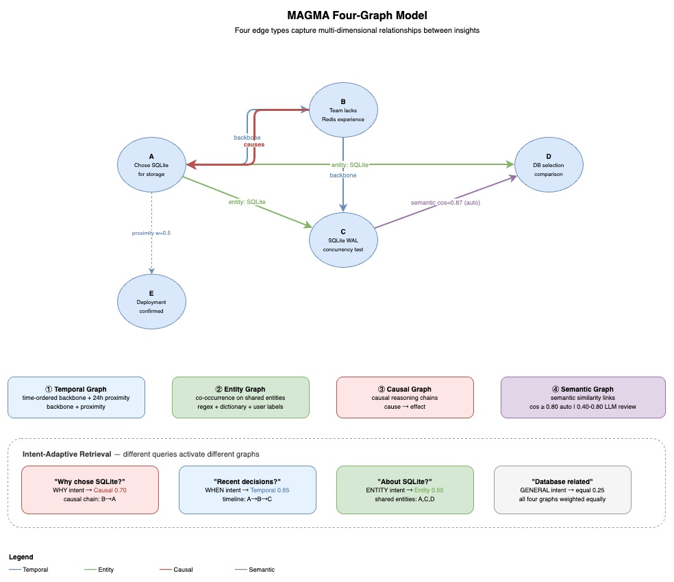

[< 返回设计概览](../DESIGN.md)

---

# 4. 图模型与理论

在 [RLM 范式](02-philosophy.md#25-理论基础)中，MAGMA 为 LLM 编排的外部环境提供了具体的 data structure。MAGMA 论文的核心思想是：**单一的 edge type（如纯 vector similarity）不足以捕捉记忆间的多维关系。** 不同的查询意图需要不同的关系视角——问"为什么"需要因果链，问"什么时候"需要时间线，问"关于 X"需要实体关联。

Mnemon 实现了四种图，每种捕捉一个维度的关系：



## 4.1 Temporal Graph（时序图）

**目的**：捕捉记忆的时间顺序，构建知识流的时间骨架。

**自动创建的边**：

- **Backbone（骨干链）**：新 insight → 同 source 的最近一条 insight（双向）
  - 确保每个来源（user/agent）的记忆形成连续的时间链
- **Proximity（近邻）**：新 insight ↔ 24 小时窗口内的 insight（双向）
  - 权重公式：`w = 1 / (1 + hours_diff)`
  - 最多 10 条近邻边

```
Insight A (2h ago) ←── backbone ──→ Insight B (1h ago) ←── backbone ──→ Insight C (now)
     ↑                                     ↑
     └──────── proximity (w=0.33) ─────────┘
```

**元数据**：`{"sub_type": "backbone"|"proximity", "hours_diff": "2.34"}`

## 4.2 Entity Graph（实体图）

**目的**：将提及相同实体的 insight 关联起来。

**实体提取（混合方式）**：
1. **正则模式**：CamelCase（`HttpServer`）、全大写（`API`）、文件路径（`./cmd/root.go`）、URL、@提及、中文书名号
2. **技术词典**：200+ 常见术语（Go, React, SQLite, Kubernetes...）
3. **用户提供**：`--entities` 标志直接指定

**自动创建的边**：新 insight ↔ 每个共享实体最多 5 条已有 insight（双向），权重 1.0。

```
                   ┌─── "Qdrant" ───┐
                   │                │
Insight A ←── entity ──→ Insight B ←── entity ──→ Insight C
("选择Qdrant")           ("Qdrant性能测试")        ("Qdrant部署配置")
```

**元数据**：`{"entity": "Qdrant"}`

## 4.3 Causal Graph（因果图）

**目的**：捕捉决策背后的原因、前因后果关系。

**自动检测**：
1. 内容中出现因果关键词（`because`, `therefore`, `due to`, `因为`, `所以`, `导致`...）
2. 与近期 insight 的 token 重叠率 ≥ 15%
3. 方向推断：根据因果关键词出现在新/旧 insight 中判断因果方向

**LLM 辅助评估**：
- `remember` 输出因果候选列表（通过 2-hop BFS 发现）
- 宿主 LLM 评估这些候选，决定是否通过 `link --type causal` 建立连接
- 支持子类型提示：`causes`（直接原因）、`enables`（使能条件）、`prevents`（阻止因素）

```
Insight A ──── causal ────→ Insight B
("团队缺乏Redis经验")     ("选择SQLite作为存储")
  sub_type: "causes"
  weight: 0.75
```

这是 LLM-Supervised 理念的典型体现：Binary 负责低成本的候选发现（正则 + token 重叠），LLM 负责高价值的因果判断。

## 4.4 Semantic Graph（语义图）

**目的**：基于语义含义连接相似的 insight。

**双层置信度系统**：

| 层级 | 余弦相似度 | 行为 |
|------|-----------|------|
| **自动链接** | ≥ 0.80 | 自动创建双向边（高置信度），最多 3 条 |
| **候选评审** | 0.40 ~ 0.79 | 输出给 LLM 评估，LLM 决定是否链接 |
| **忽略** | < 0.40 | 不处理 |

**降级方案**（无 embedding 时）：使用 token 重叠率代替余弦相似度。

```
Insight A ←── semantic (auto, cos=0.92) ──→ Insight B

Insight C ←── semantic (LLM review) ──→ Insight D
                cos=0.65, LLM判断"相关"后手动链接
```

## 4.5 四图协同：意图自适应权重

不同查询意图会激活不同的图遍历权重：

| 意图 | Causal | Temporal | Entity | Semantic |
|------|--------|----------|--------|----------|
| **WHY**（为什么） | **0.70** | 0.20 | 0.05 | 0.05 |
| **WHEN**（何时） | 0.15 | **0.65** | 0.10 | 0.10 |
| **ENTITY**（关于X） | 0.10 | 0.05 | **0.55** | 0.30 |
| **GENERAL**（通用） | 0.25 | 0.25 | 0.25 | 0.25 |

问"为什么选择 SQLite"时，因果边权重最高，系统会沿着因果链追溯决策原因；问"React 相关的记忆"时，实体边权重最高，系统会找出所有提及 React 的 insight。

---

## 4.6 Graph-LLM 理论基础

以下章节建立了图数据库作为 LLM 原生存储模型的理论基础，并阐明为什么 `remember / link / recall` 构成了 agent 记忆系统的通用协议。

### 结构同构

LLM 注意力、图数据模型和自然语言描述的是同一件事——实体间的带权关联：

```
LLM 注意力：     token ←weight→ token
图数据模型：      node  ←edge→   node
自然语言：       主语  ←谓语→    宾语
```

关系型数据库将网络关系强制压入表结构。向量数据库仅保留一种关系类型（相似度）。只有图能保留完整的关系语义。

### 三步范式：Extract → Candidate → Associate

图构建引擎普遍分解为三个步骤：

| 步骤 | 目的 | mnemon 实现 |
|------|------|------------|
| **Extract** | 将原始输入解析为结构化单元 | `remember` → nodes + entities |
| **Candidate** | 发现潜在连接 | `semantic_candidates` / `causal_candidates` |
| **Associate** | 建立有类型、有权重的边 | `link` → 5 种边类型 |

### 跨数据库类型的谱系

三步模型是一个谱系——数据模型的语义越丰富，三个步骤的表达就越完整：

| 数据库类型 | Extract | Candidate | Associate |
|-----------|---------|-----------|-----------|
| **图** | 完整 | 完整 | 完整（多类型边） |
| **关系型** | Schema 映射 | PK/唯一索引去重 | 外键（在 DDL 时固定） |
| **文档型** | 结构映射 | _id 去重 | 嵌套引用（失去全局可遍历性） |
| **向量** | Text → embedding | ANN 去重 | 仅元数据（单一关系类型） |
| **KV** | Key:value | Key 存在检查 | _（几乎没有）_ |

### 读写对称性（图独有的性质）

在图数据库上，读路径和写路径使用相同的三步模型互为镜像：

```
写入：  Extract → Candidate → Associate     (text → graph)
读取：  Extract → Candidate → Associate     (graph → text)
        (解析      (检索)       (遍历)
         查询)
```

| | 写入（构建） | 读取（查询） |
|--|------------|------------|
| **Extract** | Text → 实体/事实 | 问题 → 意图/关键词 |
| **Candidate** | 发现潜在相关节点 | 发现潜在匹配节点 |
| **Associate** | 创建边（持久化） | 遍历边（排序并返回） |
| **Reason** | _（可选：LLM 判断是否链接）_ | LLM 将结果综合为答案 |

这种对称性在其他数据库类型上**不成立**——关系型数据库的写入是 schema 映射，读取是 join 规划；两者没有共同的认知模型。

**含义**：LLM 只需掌握一种认知模式，即可同时处理图的读和写操作。

### 从 LLM 视角看：Query → Reason

无论底层数据库是什么，LLM 在读取侧的交互都归结为两步：

```
自然语言 → [Query（工具调用）] → 结构化结果 → [Reason] → 自然语言答案
```

这是 RAG 范式在任何数据存储上的应用。差异在于翻译层的复杂度：

- **Text-to-SQL**：必须理解 schema
- **Text-to-Cypher**：必须理解图结构
- **Text-to-Vector**：仅需编码，几乎零翻译

### 其他存储类型是图的退化形式

| 存储类型 | 相比图丢失了什么 |
|---------|----------------|
| **KV** | 孤立节点，零边 |
| **关系型** | 边被压缩为外键，类型固定在 schema |
| **文档型** | 边被内联为嵌套结构，全局可遍历性丢失 |
| **向量** | 所有边都是同一种类型（相似度），无语义区分 |

向量数据库能回答"什么跟什么**像**"，但不能回答"什么**导致**什么"或"什么**属于**什么"。图可以。

### remember / link / recall 作为通用代数

三步范式（Extract → Candidate → Associate）直接映射到三个原语操作：**remember**、**link**、**recall**。这不是 mnemon 的实现细节——它是任何 agent 记忆系统的最小完备接口。

```
任何记忆系统 = remember(写入) + link(关联) + recall(检索)
```

### 跨系统验证

| 系统 | remember | link | recall |
|------|----------|------|--------|
| **mnemon** | 显式三步 | 显式 5 种边类型 | 图遍历 |
| **OpenViking** | 文件写入到 viking:// | 目录归置（隐式，仅包含关系） | 路径导航 + 语义搜索 |
| **mem0** | add() | 自动去重/合并 | search() |
| **Letta/MemGPT** | insert() | 分层存储（core/recall/archival） | query() |
| **原生 RAG** | embed + upsert | _（无）_ | ANN 搜索 |

每个系统都实现了全部三个操作。差异在于：

1. **link 的显式程度**：从 mnemon 的显式多类型边到 RAG 的完全缺失
2. **link 的时机**：写入时预计算（mnemon）vs 查询时由 LLM 推断（OpenViking）
3. **recall 的信号维度**：多信号加权（mnemon）vs 单信号（向量/路径）

### OpenViking：link 折叠进 remember

OpenViking 采用文件系统范式——记忆、资源和技能作为目录组织在 `viking://` 协议下，使用 L0/L1/L2 分层上下文加载。它的 `link` 步骤并未消失，而是**折叠进了 `remember`**：选择将文件放在哪个目录中就是链接决策，退化为单一分类问题（仅包含关系边）。

这代表了一个明确的架构权衡：将关联复杂性从存储时推迟到推理时，依赖 LLM 在上下文窗口内的推理能力。当记忆量在上下文限制内时这可行，但当记忆规模超出 LLM 单次处理能力时就失去优势。

### 退化谱系

三个原语形成一个退化谱系：

```
mnemon          完全显式的 remember + link + recall
OpenViking      link 折叠进 remember（隐式包含关系）
mem0            link 自动化（去重/合并启发式）
Letta/MemGPT    link 退化为层级放置
原生 RAG         link 完全缺失
```

`link` 操作越退化，LLM 在 recall 时推断未存储关联的负担就越重。

### 协议空白：LLM ↔ Database

### 缺失的层

现有协议栈在 LLM 和数据库之间存在空白：

```
  LLM
   ↕  MCP (LLM ↔ Tools)         ← 已标准化
  Tools
   ↕  ??? (LLM ↔ Database)      ← 无协议
  Database
   ↕  ODBC/JDBC (App ↔ Database) ← 已标准化
  Storage
```

MCP 标准化了 LLM 发现和调用工具的方式。ODBC/JDBC 标准化了应用访问数据库的方式。但**LLM 如何以记忆语义与数据库交互**——这一层没有协议。

每个项目都独立地重造这一层：Mem0 构建自己的，OpenViking 构建自己的，Claude Code 的 CLAUDE.md 构建自己的（通过文件注入彻底绕开这个问题）。每个项目都混淆了两个根本不同的问题：

1. **LLM-DB 交互协议**（如何读写）—— 一个 LLM 问题
2. **DB 引擎优化**（如何高效存储和查询）—— 一个数据库问题

### 行业反模式

当前的 agent 记忆系统是将协议和存储耦合的单体：

```
Mem0             = 协议 + 自定义存储引擎
Claude Code Mem  = 无协议（文件注入 context window）
OpenViking       = 协议 + 虚拟文件系统引擎
MemGPT           = 协议 + 分层记忆管理器
```

这等同于每个 Web 应用发明自己的 HTTP。结果：无互操作性，无后端可移植性，无法利用现有数据库生态。

### remember / link / recall 作为协议原语

我们分析得出的三个原语不仅是一个分类法——它们是 **LLM 到数据库交互协议**的规范，类似于 MCP：

```
MCP:  LLM ↔ Tool
      3 个原语：resources / tools / prompts

MLP:  LLM ↔ Database
      3 个原语：remember / link / recall
      写路径 = remember + link
      读路径 = recall
```

| 维度 | MCP | Memory Layer Protocol |
|------|-----|-----------------------|
| **解决什么** | LLM 如何发现和调用工具 | LLM 如何以记忆语义读写数据库 |
| **原语** | 3（resources / tools / prompts） | 3（remember / link / recall） |
| **后端无关** | 任何工具实现 MCP server | 任何 DB 实现协议 adapter |
| **协议性质** | 发现 + 调用 | 写入 + 关联 + 检索 |

### 协议定义

```
写协议：
  remember(content, metadata) → node_id, candidates[]
  link(source, target, type, weight) → edge_id

读协议：
  recall(query, options) → ranked_results[]
```

三个动词覆盖了所有 LLM-DB 记忆交互。任何实现了这三个接口的 adapter 的数据库都可以作为 LLM 记忆后端。

### 后端 Adapter 谱系

协议天然适配不同的存储后端，表达力各异：

```
              remember        link                recall
              ─────────       ────────────────     ──────────────────
Neo4j         CREATE node     CREATE edge          MATCH + traverse
TigerGraph    add vertex      add edge             GSQL query
Milvus        upsert vec      metadata ref         ANN search
PostgreSQL    INSERT row      INSERT FK/join        SELECT + JOIN
Redis         SET key         _(退化)_              GET key
SQLite        INSERT row      INSERT edge table     multi-signal query
```

图数据库实现协议最自然——三个原语直接映射。关系型数据库需要翻译层。KV 存储只能实现 remember + recall（link 退化）。

### 战略含义

这重新定义了 mnemon 在生态中的定位：

```
         单体系统                       协议层
         （产品思路）                    （平台思路）

Mem0  ──┐                         ┌── Neo4j adapter
CC Mem──┤ 每个项目各自             │── TigerGraph adapter
Viking──┤ 重造存储层               │── Milvus adapter
MemGPT──┘                         │── SQLite adapter（当前）
                                   └── PostgreSQL adapter

                                   ↑
                              mnemon 的位置：
                              不是又一个数据库，
                              而是 LLM ↔ DB 协议网关
```

- **不跟 Neo4j 比存储引擎**（DB 问题归 DB）
- **不跟 Mem0 比产品功能**（它是绑定自身存储实现的产品）
- **与 MCP 类比**——MCP 将 LLM 接入了工具生态，这个协议将 LLM 接入数据库生态

### 学术版图与定位

### 先行工作评估

| 主张 | 最接近的先行工作 | 新颖性 |
|------|-----------------|--------|
| **结构同构**（图 = LLM 原生存储） | Transformers-as-GNNs（arXiv 2506.22084, 2012.09699）—— 计算等价性已证明，但未延伸到外部存储 | **高** |
| **remember/link/recall 作为通用代数** | CoALA（Princeton, TMLR 2024）—— retrieval/reasoning/learning，但 link 未分离为一等原语 | **高** |
| **Extract → Candidate → Associate** | NER → Entity Linking → Relation Extraction — 经典知识图谱管线 | **低**（跨记忆系统的泛化是新的） |
| **图上的读写对称性** | MAGMA（arXiv 2601.03236）主张刻意不对称（快写/慢读） | **高**（存在反证） |
| **其他存储是图的退化形式** | arXiv 2602.05665（HK PolyU, 2026.02）："传统记忆形式可以被视为图记忆范式中的退化或简化案例" | **中**（趋同发现） |
| **LLM ↔ DB 交互协议** | 未找到先行工作——所有现有系统都将协议与存储耦合 | **高** |

### 在领域中的定位

```
教科书级别（已确立）
  │  NER → Entity Linking → Relation Extraction
  │
广泛认可（高引用论文）
  │  CoALA retrieval/reasoning/learning（Princeton, TMLR）
  │  Transformers = GNNs（计算等价性）
  │
新兴共识（2026 年综述）
  │  存储类型是图的退化形式（arXiv 2602.05665）
  │  GraphRAG > Vector RAG（Neo4j Manifesto）
  │
── 我们的位置 ──────────────────────────────
  │
原创贡献（未找到先行表述）
  │  ① remember/link/recall 通用代数，link 作为一等原语
  │  ② 结构同构 → 外部存储处方
  │  ③ 图上的读写对称性（注：MAGMA 的不对称是工程反论据）
  │  ④ LLM ↔ DB 协议层 — 将协议与存储引擎分离
```

### 关键参考文献

**基础框架：**
- CoALA: Cognitive Architectures for Language Agents（Sumers et al., Princeton, TMLR 2024）
- Memory in the Age of AI Agents（Yuyang Hu et al., arXiv 2512.13564, Dec 2025）
- Graph-based Agent Memory survey（Chang Yang et al., arXiv 2602.05665, Feb 2026）

**图记忆系统：**
- MAGMA（Jiang et al., arXiv 2601.03236, Jan 2026）
- Graphiti/Zep（Rasmussen et al., arXiv 2501.13956, Jan 2025）
- Mem0（arXiv 2504.19413, Apr 2025）

**Transformers-as-graphs：**
- Transformers are Graph Neural Networks（arXiv 2506.22084, Jun 2025）
- A Generalization of Transformer Networks to Graphs（arXiv 2012.09699, 2020）

### 验证：mnemon 架构

mnemon 的设计直接反映了这些洞察：

```
remember → Extract + Candidate（semantic_candidates / causal_candidates）
link     → Associate（semantic / causal / entity / temporal / narrative）
recall   → Extract + Candidate + Associate（意图检测 → 多信号检索 → 图遍历）
```

五种边类型保留了五种不同的关系语义。退化为纯向量检索将仅保留 `semantic` —— 丢失约 80% 的关系信息。MAGMA 消融研究确认：移除因果边使准确率下降 3-5%，移除时序边使其进一步下降。

### 总结

- **Extract → Candidate → Associate** 是图构建引擎的通用范式
- 这一三步模型在图上达到**最完整的表达**，并向 KV 方向退化
- 在图上，读写路径是**对称的**——两者遵循同一个三步模型的相反方向
- 从 LLM 视角看，读取普遍归结为 **Query → Reason**
- 图是 LLM 的原生存储模型，因为它们是**结构同构的**：两者都表示实体间的带权关联
- **remember / link / recall** 是 agent 记忆系统的通用代数——每个系统都是这三个原语的实例化，`link` 的退化程度各异
- 三个原语定义了一个 **LLM ↔ Database 交互协议**——类似于工具的 MCP，填补了 LLM 与数据库生态之间缺失的层
- mnemon 的战略定位是**协议网关**，而非数据库引擎——将 LLM 交互问题与存储优化问题分离
